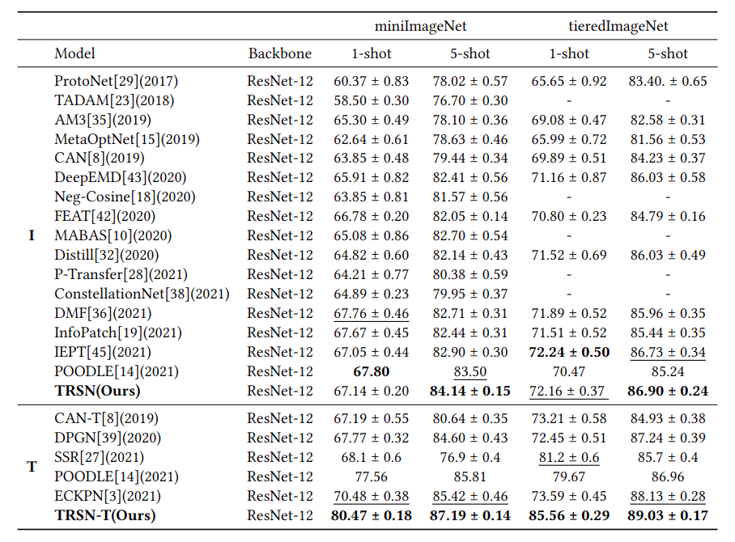

# Task-Related Saliency for Few-Shot Image Classification
This is an official implementation in Tensorflow of TRSN.

## Abstract
A weakness of the existing metric-based few-shot classification method is that the model may be misled by the task-unrelated background since the small number of samples in the support set is not enough to reveal the local feature of the target from the background. An essential cue of human wisdom in the few-shot classification task is that they can find the task-related targets by a glimpse of support images. Thus, we propose to explicitly learn task-related saliency features and make use of them in the metric-based few-shot learning schema. We divide the tackling of the task into three phases, namely, the Modeling, the Analyzing, and the Matching. In the modeling phase, we introduce a Saliency Sensitive Module (SSM), which is an inexact supervision task jointly trained with a standard multi-class classification task. SSM not only enhances the fine-grained representation of feature embedding, but also can locate the task-related saliency features. Meanwhile, we propose a self-training-based Task-Related Saliency Network (TRSN) which is a lightweight network to distill task-related salience produced by SSM. In the analyzing phase, we freeze TRSN and use it to find out the task-related targets of novel tasks. In the matching phase, the fine-grained features enhanced by TRSN can promote the model to pay more attention to task-related objects. We conduct extensive experiments on 5-way 1-shot and 5-way 5-shot settings to evaluate the proposed method. Results show that our method achieves a consistent performance gain on benchmarks and achieves state-of-the-art. 
## Performance

### Environment
- CUDA == 10.1
- Tensorflow == 2.2.0 

